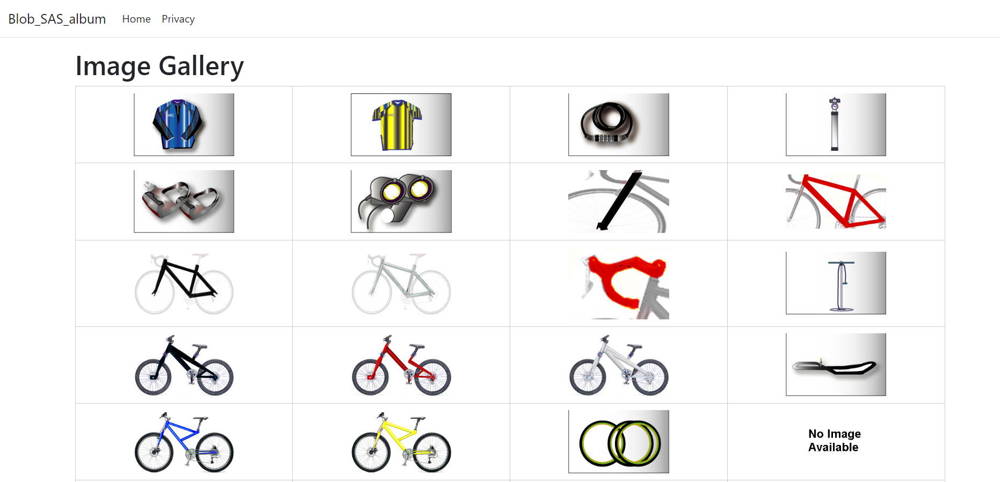
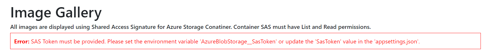
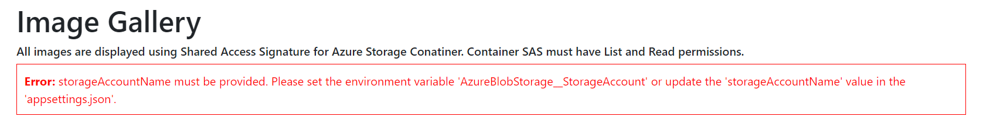
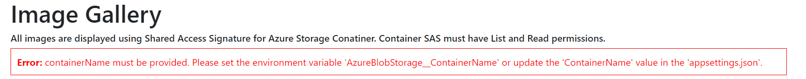
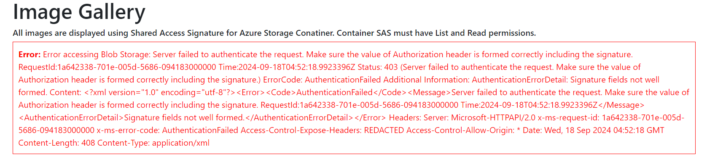

If application is working fine then you will see the output like this.

If SAS token is not specified in App settings/Environment variables. 

If StorageAccount is not specified in App settings/Environment variables. 

If StorageAccount is not specified in App settings/Environment variables. 

If any error occurred.You will see error message.

